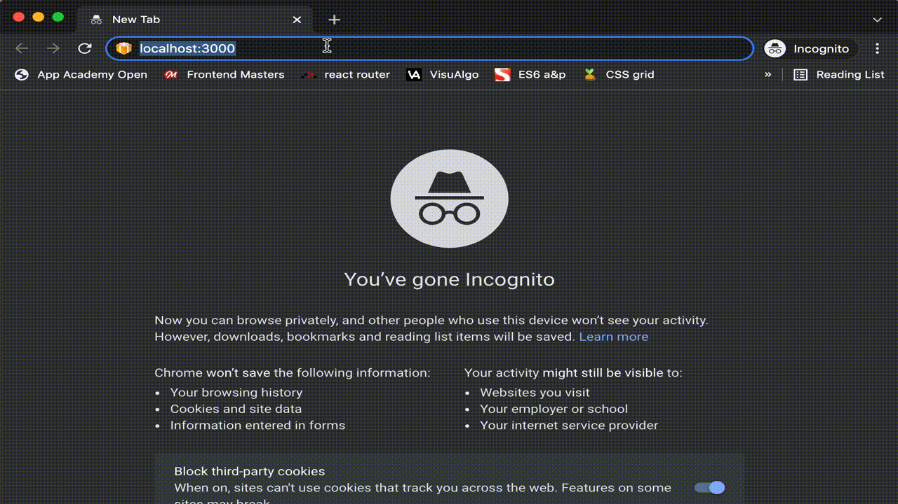

# Reward Portal

## Goals
- Create a React app that:
	+ Display a form with inputs for each field outlined below
  + Allow a user to complete and submit the form
	+ Do not allow form submission without completing the entire form
	+ Provide feedback upon successful form submission

```sh
{
    "name": "???",
    "email": "???",
    "password": "???",
    "occupation": "???",
    "state": "???"
}
```

## Demo



## Tech Stack
* [React](https://reactjs.org)
* [Node](https://nodejs.org/en)
* [Express](https://expressjs.com)

## Building and Running Environment

1. First install dependencies:

```sh
npm install
```

3. To create a development build:

```sh
npm run build-dev
```

4. To run node server:

```sh
npm start
```